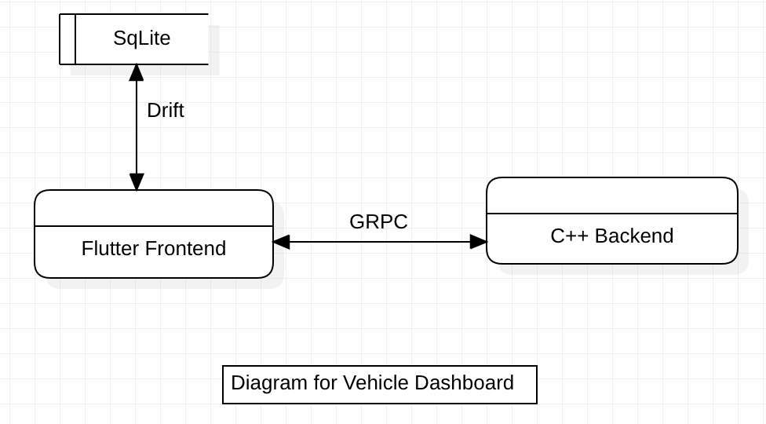

# Vehicle Dashboard

This is the mini project that demostrates the networking betweeen flutter frontend and c++ backend by using GRPC and protobuf (the alternative solution of capnproto).

The targeted platform is for desktops and not for mobile OS. Mac is used on development time but it should work on ubuntu too.

the root directory is simply the flutter project.

grpc_server directory is c++ server project that can servers the request from flutter frontend. In default state, server process and client process needs to be in the same machine because of port and IP address configuration. For remote communication, port and IP address must be changed (Firewall and other permission configuration need to be changed too)

protos directories are the one storing proto files to define rpc methos and messages.

At flutter frontend side,
 1. dirft (SqLite Library for flutter) is used to store records in frontend side.
 2. for state management, low level solution (stateful wdigets) are used.
 3. reactive programming is used in the project. Streambuilders are notable so much in the codebase.
 4. For the communication betweeen widgets, provider is used currently.
 5. Vehicle Client (vehicle_client.dart) is used to communicate with GRPC server.
 6. Db Client (db_client.dart) is used to communicate with SqLite db in frontend side.
 7. CRUD codes for records can be found in flutter codebase.
 8. Reusable widgets, clients, generated code files (proto files), page and panels are seperated stored.

 At C++ backend side,
  1. There are somethings you need to build the server smoothly: VS Code, vcpkg, cmake and a compiler (clang was used in development).
  2. vcpkg should be configured in the vs code. If not `-DCMAKE_TOOLCHAIN_FILE=/home/aa/vcpkg/scripts/buildsystems/vcpkg.cmake` is required in cmake build process.
  3. The c++ project depends GPPC and proto buff by the use of that vcpkg.
  4. The server part serves some calulations and data response to the frontend side.

## FAQ

#### How about rust server?

Of course. Rust can be used to build the GRPC server too. But in the limited short time, I chose c++ for the solution. If there is some request to build a rust server, there will be rust server too.

#### Can we make more secure communication between frontend and server?

In the production of the real world project, sort of authentication should be considered to use in GRPC if needed. But for this demostration project, smoother and clearer communication is chosen to understand more easily.

#### Can we make more beautiful UI for the frontend?

Yes, we can. Beacuse the main purpose of this demostration project is to demostrate the full stack development that needs both of Flutter and C++, we prefer to make minimal UI compatible with the server side.

#### Does this works on ubuntu ?

In the development peroid, Mac was used to build the App but this should work on ubuntu too. But you can need to configure Firewall and some permission stuff for the first build time.

#### Are the drive interface in frontend and calculations in backend the same with the real world vehicle ?

